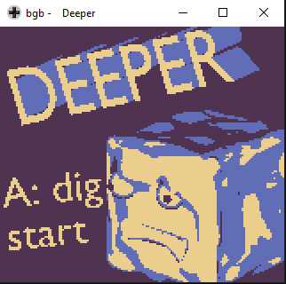
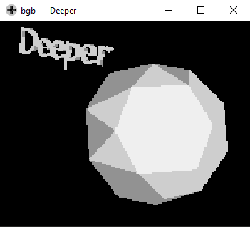
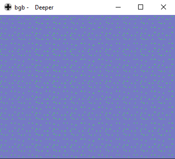
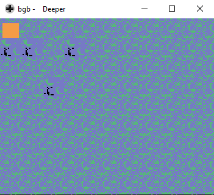
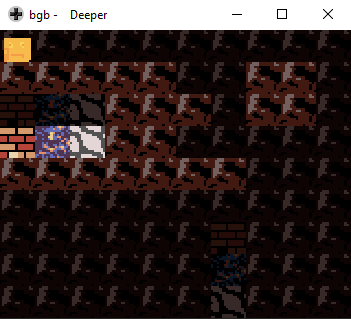
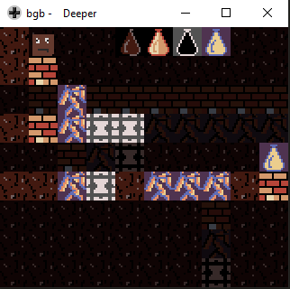

# Ludum Dare 48 Deeper

<div style="text-align:center"></img></div>

## Update
The V2 is available!
This version should be out of the LudumDare competition. It provide:
 - B button to reset the level
 - the score
 - some glitches fixes

## The game
Deeper is a Game Boy Color game. The aim is to dig. You can also drink potions to allow you to dig other materials.
You can find here the Ludum Date web page: https://ldjam.com/events/ludum-dare/48/deeper-2

The release can be found here : https://github.com/robinfaury/LudumDare48_Deeper/releases

Controls:
 - Left button: rotate left
 - Right button: rotate right
 - A button: dig
 - [Only for V2] B button: Reset the level

## How to build [Windows]

```shell
git clone https://github.com/robinfaury/LudumDare48_Deeper.git
cd LudumDare48_Deeper
build.bat
```

## Development step

<div style="text-align:center"></img></div>
<div style="text-align:center"></img></div>
<div style="text-align:center"></img></div>
<div style="text-align:center"></img></div>
<div style="text-align:center"></img></div>
<div style="text-align:center"></img></div>
